# 📊 Documentation Complète - Dashboard Agencies & Contacts

---

## 1. Vue d'Ensemble du Projet

### 1.1 Description

Dashboard Agencies & Contacts est une application web moderne permettant de gérer et consulter des agences et leurs contacts. L'application implémente un système d'authentification sécurisé et une limitation quotidienne de consultation pour encourager les upgrades premium.

### 1.2 Objectifs

- **Gestion Centralisée:** Visualiser toutes les agences et contacts en un seul endroit
- **Sécurité:** Authentification obligatoire via Clerk
- **Limitation Intelligente:** 50 consultations de contacts par jour pour les utilisateurs gratuits
- **Expérience Utilisateur:** Interface moderne, responsive et intuitive
- **Scalabilité:** Architecture prête pour l'ajout de fonctionnalités premium

### 1.3 Technologies Utilisées

| Technologie | Version | Utilisation |
|-------------|---------|-------------|
| Next.js | 16.0.5 | Framework React avec App Router |
| React | 19.0.0 | Bibliothèque UI |
| TypeScript | 5.x | Typage statique |
| Tailwind CSS | 3.4.16 | Styling et design |
| Clerk | 6.14.0 | Authentification et gestion utilisateurs |
| Papaparse | 5.4.1 | Parsing de fichiers CSV |
| Lucide React | 0.460.0 | Icônes modernes |
| Vercel | - | Plateforme de déploiement |

### 1.4 Prérequis Système

- **Node.js:** Version 18.x ou supérieure
- **npm:** Version 9.x ou supérieure
- **Navigateurs supportés:** Chrome, Firefox, Safari, Edge
- **Système d'exploitation:** Windows, macOS, Linux

---

## 2. Architecture Technique

### 2.1 Architecture Globale

L'application suit une architecture client-serveur moderne avec authentification centralisée.

```mermaid
graph TB
    subgraph "Frontend - Next.js 16"
        A[Page Login] --> B{Clerk Auth}
        B -->|Non authentifié| A
        B -->|Authentifié| C[Dashboard Layout]
        C --> D[Page Agencies]
        C --> E[Page Contacts]
        E --> F{Vérifier Limite}
        F -->|< 50 contacts/jour| G[Afficher Contacts]
        F -->|>= 50 contacts/jour| H[Modal Upgrade]
    end

    subgraph "Gestion des Données"
        I[CSV Agencies] --> J[API Route /api/agencies]
        K[CSV Contacts] --> L[API Route /api/contacts]
        J --> D
        L --> E
        M[Storage Limite] --> F
    end

    subgraph "Authentification"
        N[Clerk Provider] --> B
        O[Middleware Protection] --> C
    end

    style B fill:#4F46E5
    style F fill:#EF4444
    style H fill:#F59E0B
```

---

Déploiement : https://agencies-8dlb.vercel.app/dashboard/agencies
